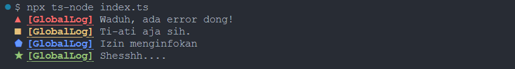

# NodeJS Logger

Wrapper [Winston](https://www.npmjs.com/package/winston) yang dibuat dengan mengerahkan segala kekuatan cinta, jiwa, dan raga yang dimiliki oleh para kontributor. Tampilan tulisan dihias menggunakan modul [Chalk](https://www.npmjs.com/package/chalk). Y'all should be thankful. Ini bakalan kepake di berbagai projek kedepannya.

## Spec

- Empat level _logging_ dengan warna dan bentuk bangun datar yang unik dan imuyy. ✨✨
- Ada dua _stream_, yaitu _console_ (ditampilkan ke konsol) dan _file_ (ditulis ke berkas).
- Terdapat fungsi untuk membuat _instance_ baru, sehingga tiap _logger_ punya labelnya masing-masing.

Berikut adalah tampilan _console stream_-nya.

